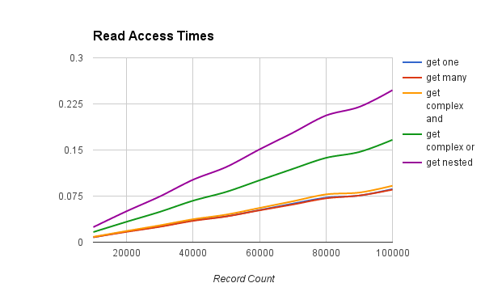
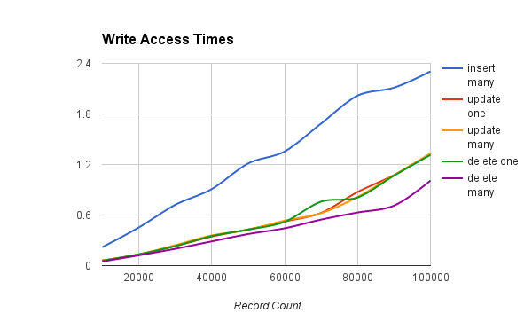

# Performance
The purpose of this document is to describe the performance characteristics of EssentialDB over a range of data sizes. Since the purpose of EssentialDB is to aid speed of development in the early stages while allowing the project to scale, I wanted the test to have a real world flavor.

Think about this scenario:

>Your team has a short fuse program kick off to create an in-house ticket tracking system ASAP. Initially, it will only be used by the local office, but if it tests well your manager is hoping to open it up to other branches over the next year. At the kick off meeting, she announces that she is even hoping to get corporate to adopt it if it tests well.

We've all been here. Speed of development is the most pressing factor, but scalability matters too.

>Some quick napkin sketches tell you that each branch will add around a hundred new users, and new projects and whole new use cases. If you pull this off, it could be a big deal for your career, but the first milestones are just weeks away...

If you choose EssentialDB to kickstart your development, we want to make sure you understand exactly how it will scale. The figures below illustrate how EssentialDB scales in this use case, while the dataset grows from 10k to 100k. These test were ran on generated mock data designed to model a growing database for a ticket tracking system. I ran them on a standard AWS T2.medium. The methodology is covered in detail in the rest of the article.

What do these graphs tell us about EssentialDB? In this scenario, it scaled linearly and reads are much more efficent than writes. For our use case, it looks like a pretty fair solution at the early stages, to demonstrate progress quickly and see if the product catches on. It a good thing that all your queries should work for MongoDB right out the box!

## The Data

The first requirement here is that tests could be replicated - this required consistent data. For this, we generated all the data up front. The documents are based on the following example:

    {
        "permissions":{
            "owner": "randomuser@example.com",
            "contributors": ["rand1@example.com", "rand2@example.com" ...]
        },
        "slug": "a_unique_string",
        "created": 1470455125.213304,
        "due": 1474083925.213304,
        "priority": "minor",
        "status": "started",
        "projects": ["project1", "project2" ... ],
        "labels": ["python", "database" ... ],
        "title": "Test Python Databases",
        "details": "Test several python databases head to head."
     }

I created a script to generate random data and save it to disk as plain old python objects (dictionaries really) using shelve. This way, the data can be read into the different databases so that results are constant. The script generates each data entry using the following rules:

* **permissions** - Complex object
* **permissions.owner** - Random fake email address from users list
* **permissions.contributers** - Array of 0 to 3 fake email addresses from users list
* **slug** - A unique string based on the project name and incrementing counts
* **created** - Integer epoch timestamp of creation (1 to 500 days in the past)
* **due** -  Integer epoch timestamp the task is due (0 to 30 days after created timestamp)
* **priority** - randomly selected from [none, minor, major, critical, blocker]
* **status** - randomly selected from [none, started, blocked, closed, completed]
* **projects** - Array of 1 to 4 words, randomly selected from a list of generated project 'names'
* **labels** - Array of 0 to 3 labels, randomly selected from a list of generated labels
* **title** - String 4 to 12 random lorem ipsum words
* **description** - String of 1 and 10 random lorem ipsum paragraphs

The script begins with 10k records and then adds 10k records until it reaches 100k, saving each iteration to disk [100k, 200k, 300k ... 1000k]. To model growth you might see in a real system, for each 100 k records added, the script generates 1000 additional users, project names and labels to be randomly selected when generating new entries. After the new entries are added to the dataset, the script shuffles before writing to disk.

With 10 files ranging from 10K to 100K - modeling snapshots of a growing database - we are ready to start looking at the tests.

## The Tests

I created a timing script <LINK HERE> to run through each of the previously stored datasets. Basically, it operates list this

    For dataset in [10k, 20k ... 100k]
        populate database
        For each function
            For each iteration
                initialize database object
                start timer
                run function
                stop timer
             average = time/iterations

### Functions

* **insert_multiple** - Adds a list of documents into the database
* **get_one** - Queries for one document by slug
* **get_many** - Query for all documents where priority == minor
* **get_complex_and** - Query for all documents where priority == blocker AND status == blocked
* **get\_complex\_or** - Query for all documents where status == closed OR priority == critical
* **get_nested** - Query for all documents where permissions.owner == prechosen name
* **update_one** - Update one document to have status = completed
* **update_many** - Update all where priority == minor to have status = closed
* **delete_one** - Delete one document by slug
* **delete_many** - Delete all documents where status == none

## The Results

Records|get one|get many|get complex and|get complex or|get nested
-------|-------|--------|---------------|--------------|----------
10000|0.021|0.021|0.023|0.031|0.032
20000|0.042|0.042|0.046|0.063|0.064
30000|0.062|0.061|0.069|0.091|0.096
40000|0.085|0.084|0.094|0.126|0.130
50000|0.102|0.101|0.115|0.153|0.160
60000|0.125|0.123|0.140|0.182|0.192
70000|0.148|0.147|0.165|0.216|0.228
80000|0.171|0.169|0.190|0.250|0.263
90000|0.183|0.182|0.207|0.273|0.287
100000|0.206|0.203|0.231|0.301|0.320

Records|insert many|update one|update many|delete one|delete many
-------|-----------|----------|-----------|----------|-----------
10000|0.25|0.10|0.09|0.10|0.07
20000|0.52|0.20|0.20|0.20|0.17
30000|0.76|0.33|0.33|0.34|0.28
40000|1.08|0.47|0.47|0.47|0.39
50000|1.26|0.61|0.59|0.83|0.50
60000|1.54|0.70|0.71|0.70|0.60
70000|1.93|0.83|0.84|0.83|0.71
80000|2.11|1.07|1.07|1.06|0.82
90000|2.53|1.42|1.39|1.34|0.94
100000|2.60|1.63|1.65|1.63|1.25

## Analysis
Currently, performance is pretty good for a pure python database. In this scenario, it scaled linearly and reads are much more efficent than writes. There are many use cases where it's current performance would be suitable and many where it would not be.
